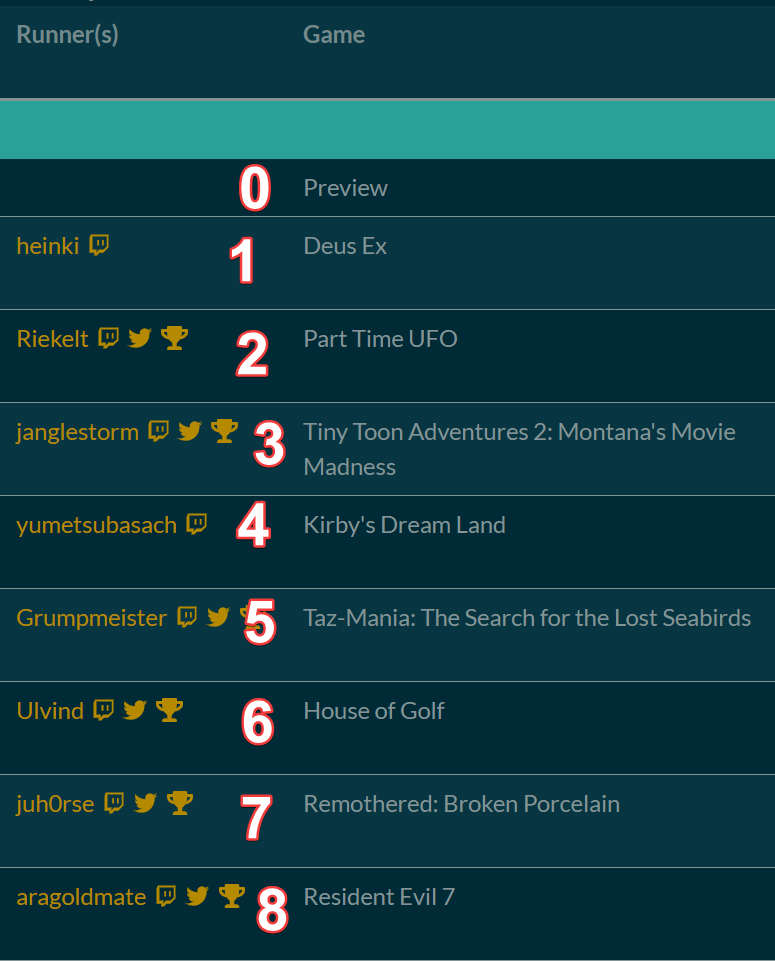

# hereford

Speedrun marathon text-switching made easy

## Features

- Automatic Horaro and Oengus schedule import
- Output to separate text files for use in OBS or other streaming programs.
- Configurable output for the run's estimate.
- Gives you text file to show the previous and upcoming 3 runs for use in an intermission/break screen

## Install

Just download the .exe from [**releases**](https://github.com/riek-lt/hereford/releases) and open it. This will create a folder with some text files in it that you use in OBS. Make sure that it is in a folder that doesn't need special writing permissions.

## Usage

Upon opening, you will need to fill in the full URL to an Oengus or Horaro run, or the slug to an Oengus run. For Oengus' example, if your URL is `https://oengus.io/marathon/bsgo3`, the slug would be `bsgo3`.
After you have filled in the link click the `fetch url` button and the marathon should be fetched and your files should be filled.

<!-- Afterwards, if this isn't the first start of the program, it checks if you got a marathon going on, and prompts you if you want to resume that session. Otherwise, it asks if you want to start from the beginning. -->


### Jumping to runs

Note for jumping: This works by inputting the number of the order it appears in the schedule. For example:



**Note** that we start counting at 0.

## Horaro instructions

Currently, for the columns, this program will only work if you name the columns "Game", "Category", "Console" and "Runners". Order doesn't matter, just the string needs to be precise. Doesn't work with URLs (yet).

## Future features

- A more fleshed out GUI
- Where possible automatic stream title/game changes
- Changing values live from the program
- Automate builds

## Used in marathons

- [Italian Speedrun Marathon Online](https://oengus.io/marathon/ISMO)
- [Support Autism Speed Event (SASE)](https://www.twitch.tv/sase_marathon)

## Contributing to the project

### Instalation

To work on the project you will first need to install some things to build and work on the project.

- Install go
  https://golang.org/dl/

- get wails

```bash
go get github.com/wailsapp/wails/cmd/wails
```

and install its dependencies like `tdm-gcc` and `npm`
and install tdm-gcc
https://jmeubank.github.io/tdm-gcc/download/

for more info on the wails setup see:
https://wails.app/gettingstarted/

### Build

Build the project using

```bash
wails build
```

or get a development build with

```bash
wails build -d
```

For more information on how to debug your wails app you can check out [wails.app/guides/debugging/](https://wails.app/guides/debugging/)

**Note** that you need to be in the `hereford` directory to do this (you will get a warning if you are not)

## Credits

This program was made by [Riek-lt](https://twitter.com/riek_lt)

### Contributors

- [Vuurvos1](https://github.com/vuurvos1)
