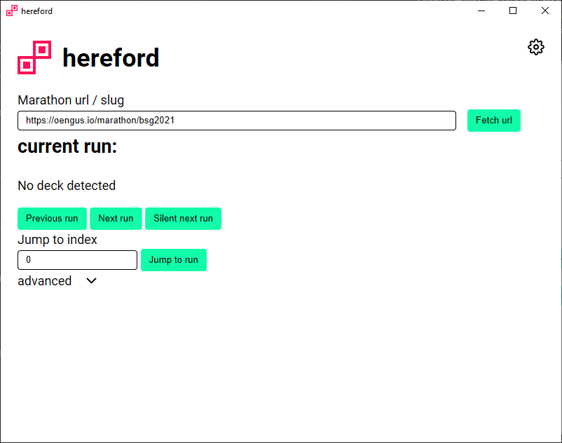

# Hereford

## Speedrun marathon text-switching done easy

# Features
- Automatic Horaro and Oengus schedule import
- Output to separate text files for use in OBS or other streaming programs.
- Configurable output for the run's estimate.
- Gives you text file to show the previous and upcoming 3 runs for use in an intermission/break screen

# Install
Just download the .exe from [**releases**](https://github.com/riek-lt/hereford/releases) and open it. This will create a folder with some text-files in it that you use in OBS. Make sure that it is in a folder that doesn't need special writing permissions.

# Usage
Upon opening, the program asks you for your slug from Oengus or a full Horaro URL. For Oengus' example, if your URL is `https://oengus.io/marathon/bsgo3`, the slug would be `bsgo3`.
Afterwards, if this isn't the first start of the program, it checks if you got a marathon going on, and prompts you if you want to resume that session. Otherwise, it asks if you want to start from the beginning.

## Horaro instructions
Currently, for the columns, this program will only work if you name the columns "Game", "Category", "Console" and "Runners". Order doesn't matter, just the string needs to be precise (and case-sensitive). Doesn't work with URLs (yet).

## Main loop
In the main program, it will wait for your input before it does anything. You can use either the input, or the bolded word as input
|  Input | Function  |
|--|--|
| n | Continues to the **next** run |
| p | Goes back to the **previous** run |
| j | makes you **jump** and write to a certain run (more info below) |
| sj | **Silent jump**, jumps to a certain run, but doesn't write to files (more info below) |
| sn | **Silent next**, does a "next" to the next run, without writing to files |
| s | Go back to the **start** of the marathon |
| u | Makes you **reload**. Handy for when new runs got added. |
| nd | Loads in the **next deck**. |

Note to jumping: This works by inputting the number of the order it appears in the schedule. For example:

  

Note that the first run is #0.

## Future features
- A more fleshed out GUI
- Where possible automatic stream title/game changes
- Changing values live from the program

## Used in marathons
- [Italian Speedrun Marathon Online](https://oengus.io/marathon/ISMO)

## Credits
This program was made by [Riek-lt](https://twitter.com/riek_lt)
